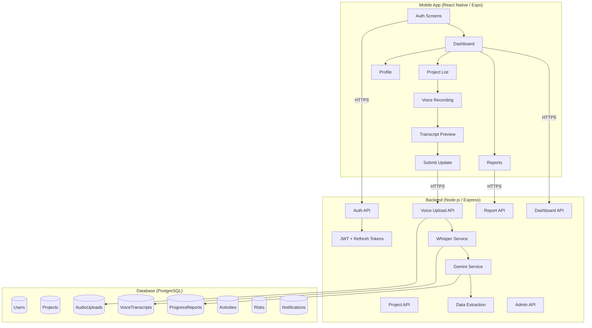
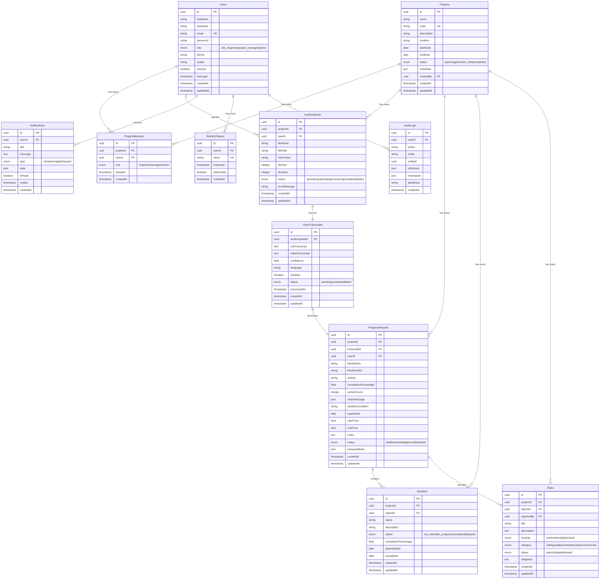

# SiteVoice AI — Implementation Plan

A production-ready cross-platform mobile app for construction site engineers to record voice updates, transcribe audio via OpenAI Whisper, extract structured project data via Gemini AI, and generate automated daily progress reports.

## User Review Required

> [!IMPORTANT]
> **Expo vs Bare React Native CLI**: Based on current best practices (2026), Expo is now the officially recommended approach for React Native. It supports custom native modules via Config Plugins/Prebuild while simplifying builds and OTA updates. I recommend using **Expo** with `expo-audio` for recording. If you have a strong preference for bare React Native CLI, please let me know.

> [!IMPORTANT]
> **Sequelize Version**: Sequelize v7 has native TypeScript support with decorators. I'll use **Sequelize v6** (stable, widely adopted) with `sequelize-typescript` for decorator-based models unless you prefer v7 (still in alpha/beta). Please confirm.

> [!WARNING]
> **API Keys Required**: The app requires API keys for OpenAI (Whisper) and Google Gemini. These must be configured in `.env` files. No keys will be hardcoded.

> [!IMPORTANT]
> **Audio File Storage**: Audio files will be stored on the local filesystem (configurable path via env var). For production, you'd typically use S3/GCS. I'll build the storage layer with an abstraction that makes it easy to swap to cloud storage. Please confirm this approach.

## Open Questions

1. **Push Notification Provider**: Should we use Firebase Cloud Messaging (FCM) for push notifications, or do you have another preference (e.g., Expo Push Notifications)?
2. **Email Service**: For forgot password flow, which email provider? (e.g., SendGrid, AWS SES, Nodemailer with SMTP)
3. **Deployment Target**: Are you targeting Docker Compose for local/staging, or do you need Kubernetes manifests as well?
4. **Audio Format**: Expo-audio records in `.m4a` by default. Whisper supports `m4a, mp3, wav, webm`. Shall we stick with `.m4a`?

---

## Architecture Overview



---

## Project Structure

```
SiteVoice.AI/
├── mobile/                          # React Native (Expo) App
│   ├── app/                         # Expo Router screens
│   │   ├── (auth)/                  # Auth group
│   │   │   ├── login.tsx
│   │   │   ├── register.tsx
│   │   │   ├── forgot-password.tsx
│   │   │   └── _layout.tsx
│   │   ├── (app)/                   # Authenticated group
│   │   │   ├── (tabs)/              # Tab navigator
│   │   │   │   ├── index.tsx        # Home Dashboard
│   │   │   │   ├── projects.tsx     # Project List
│   │   │   │   ├── reports.tsx      # Reports
│   │   │   │   ├── profile.tsx      # Profile
│   │   │   │   └── _layout.tsx
│   │   │   ├── project/
│   │   │   │   ├── [id].tsx         # Project Details
│   │   │   │   └── record/[id].tsx  # Voice Recording
│   │   │   ├── transcript/
│   │   │   │   └── [id].tsx         # Transcript Preview/Edit
│   │   │   ├── admin/               # Admin screens
│   │   │   │   ├── users.tsx
│   │   │   │   ├── manage-projects.tsx
│   │   │   │   └── roles.tsx
│   │   │   └── _layout.tsx
│   │   └── _layout.tsx              # Root layout
│   ├── src/
│   │   ├── components/              # Reusable UI components
│   │   │   ├── ui/                  # Base components (Button, Input, Card...)
│   │   │   ├── audio/               # Audio recording components
│   │   │   ├── charts/              # Chart/graph components
│   │   │   └── layout/              # Layout components
│   │   ├── features/                # Feature-specific logic
│   │   │   ├── auth/
│   │   │   ├── projects/
│   │   │   ├── recording/
│   │   │   ├── reports/
│   │   │   └── admin/
│   │   ├── hooks/                   # Custom hooks
│   │   ├── services/                # API service layer (Axios)
│   │   ├── stores/                  # Zustand stores
│   │   ├── types/                   # TypeScript types/interfaces
│   │   ├── utils/                   # Utility functions
│   │   ├── constants/               # App constants
│   │   └── theme/                   # Theme configuration
│   ├── assets/                      # Fonts, images, icons
│   ├── app.json                     # Expo config
│   ├── tsconfig.json
│   └── package.json
│
├── backend/                         # Node.js / Express API
│   ├── src/
│   │   ├── config/                  # DB, env, app config
│   │   │   ├── database.ts
│   │   │   ├── environment.ts
│   │   │   └── swagger.ts
│   │   ├── controllers/             # Request handlers
│   │   │   ├── auth.controller.ts
│   │   │   ├── project.controller.ts
│   │   │   ├── voice.controller.ts
│   │   │   ├── transcript.controller.ts
│   │   │   ├── report.controller.ts
│   │   │   ├── dashboard.controller.ts
│   │   │   ├── admin.controller.ts
│   │   │   └── notification.controller.ts
│   │   ├── middleware/              # Express middleware
│   │   │   ├── auth.middleware.ts
│   │   │   ├── role.middleware.ts
│   │   │   ├── validation.middleware.ts
│   │   │   ├── upload.middleware.ts
│   │   │   ├── error.middleware.ts
│   │   │   ├── rateLimiter.middleware.ts
│   │   │   └── logger.middleware.ts
│   │   ├── models/                  # Sequelize models
│   │   │   ├── User.ts
│   │   │   ├── Project.ts
│   │   │   ├── ProjectMember.ts
│   │   │   ├── AudioUpload.ts
│   │   │   ├── VoiceTranscript.ts
│   │   │   ├── ProgressReport.ts
│   │   │   ├── Risk.ts
│   │   │   ├── Activity.ts
│   │   │   ├── Notification.ts
│   │   │   ├── AuditLog.ts
│   │   │   ├── RefreshToken.ts
│   │   │   └── index.ts             # Model associations
│   │   ├── routes/                  # API routes
│   │   │   ├── auth.routes.ts
│   │   │   ├── project.routes.ts
│   │   │   ├── voice.routes.ts
│   │   │   ├── transcript.routes.ts
│   │   │   ├── report.routes.ts
│   │   │   ├── dashboard.routes.ts
│   │   │   ├── admin.routes.ts
│   │   │   └── index.ts
│   │   ├── services/                # Business logic
│   │   │   ├── auth.service.ts
│   │   │   ├── project.service.ts
│   │   │   ├── voice.service.ts
│   │   │   ├── transcript.service.ts
│   │   │   ├── whisper.service.ts
│   │   │   ├── gemini.service.ts
│   │   │   ├── report.service.ts
│   │   │   ├── dashboard.service.ts
│   │   │   ├── notification.service.ts
│   │   │   └── auditLog.service.ts
│   │   ├── repositories/            # Data access layer
│   │   │   ├── user.repository.ts
│   │   │   ├── project.repository.ts
│   │   │   ├── voice.repository.ts
│   │   │   └── report.repository.ts
│   │   ├── validators/              # Zod schemas
│   │   │   ├── auth.validator.ts
│   │   │   ├── project.validator.ts
│   │   │   ├── voice.validator.ts
│   │   │   └── report.validator.ts
│   │   ├── utils/                   # Helpers
│   │   │   ├── logger.ts
│   │   │   ├── errors.ts
│   │   │   ├── response.ts
│   │   │   └── helpers.ts
│   │   ├── types/                   # TypeScript interfaces
│   │   │   ├── express.d.ts
│   │   │   ├── api.types.ts
│   │   │   └── ai.types.ts
│   │   ├── app.ts                   # Express app setup
│   │   └── server.ts                # Server entry point
│   ├── migrations/                  # Sequelize migrations
│   ├── seeders/                     # Database seeders
│   ├── uploads/                     # Audio file storage (gitignored)
│   ├── logs/                        # App logs (gitignored)
│   ├── .sequelizerc
│   ├── tsconfig.json
│   ├── package.json
│   └── Dockerfile
│
├── docker-compose.yml               # Docker orchestration
├── .env.example                     # Environment template
├── .gitignore
└── README.md
```

---

## Database Design

### Entity Relationship Diagram



---

## API Design

### Authentication APIs
| Method | Endpoint | Description | Auth |
|--------|----------|-------------|------|
| POST | `/api/v1/auth/register` | Register new user | No |
| POST | `/api/v1/auth/login` | Login | No |
| POST | `/api/v1/auth/logout` | Logout (revoke refresh token) | Yes |
| POST | `/api/v1/auth/refresh-token` | Refresh access token | No |
| POST | `/api/v1/auth/forgot-password` | Send reset email | No |
| POST | `/api/v1/auth/reset-password` | Reset password with token | No |
| GET | `/api/v1/auth/me` | Get current user profile | Yes |
| PUT | `/api/v1/auth/change-password` | Change password | Yes |

### Project APIs
| Method | Endpoint | Description | Roles |
|--------|----------|-------------|-------|
| GET | `/api/v1/projects` | List projects (filtered by user membership) | All |
| GET | `/api/v1/projects/:id` | Get project details | Members |
| POST | `/api/v1/projects` | Create project | PM, Admin |
| PUT | `/api/v1/projects/:id` | Update project | PM, Admin |
| DELETE | `/api/v1/projects/:id` | Delete project | Admin |
| POST | `/api/v1/projects/:id/members` | Add member | PM, Admin |
| DELETE | `/api/v1/projects/:id/members/:userId` | Remove member | PM, Admin |

### Voice Upload APIs
| Method | Endpoint | Description | Roles |
|--------|----------|-------------|-------|
| POST | `/api/v1/voice/upload` | Upload audio file | Engineer |
| GET | `/api/v1/voice/uploads` | List user's uploads | All |
| GET | `/api/v1/voice/uploads/:id` | Get upload details | Owner |
| POST | `/api/v1/voice/uploads/:id/process` | Trigger AI processing | Engineer |
| DELETE | `/api/v1/voice/uploads/:id` | Delete upload | Owner |

### Transcript APIs
| Method | Endpoint | Description | Roles |
|--------|----------|-------------|-------|
| GET | `/api/v1/transcripts/:id` | Get transcript | Owner, PM |
| PUT | `/api/v1/transcripts/:id` | Edit transcript | Owner |
| POST | `/api/v1/transcripts/:id/reprocess` | Re-extract data from edited transcript | Owner |

### Report APIs
| Method | Endpoint | Description | Roles |
|--------|----------|-------------|-------|
| GET | `/api/v1/reports` | List reports (with filters) | All |
| GET | `/api/v1/reports/:id` | Get report details | Members |
| PUT | `/api/v1/reports/:id` | Update/approve report | PM |
| POST | `/api/v1/reports/:id/submit` | Submit draft report | Engineer |
| GET | `/api/v1/reports/daily` | Daily aggregated report | PM, Admin |
| GET | `/api/v1/reports/weekly` | Weekly aggregated report | PM, Admin |
| GET | `/api/v1/reports/monthly` | Monthly aggregated report | PM, Admin |

### Dashboard APIs
| Method | Endpoint | Description | Roles |
|--------|----------|-------------|-------|
| GET | `/api/v1/dashboard/overview` | Dashboard stats | All |
| GET | `/api/v1/dashboard/projects/:id/progress` | Project progress | Members |
| GET | `/api/v1/dashboard/risks` | Risks overview | PM, Admin |
| GET | `/api/v1/dashboard/activities` | Pending activities | PM, Admin |
| GET | `/api/v1/dashboard/timeline` | Activity timeline | All |

### Admin APIs
| Method | Endpoint | Description | Roles |
|--------|----------|-------------|-------|
| GET | `/api/v1/admin/users` | List all users | Admin |
| PUT | `/api/v1/admin/users/:id` | Update user | Admin |
| DELETE | `/api/v1/admin/users/:id` | Deactivate user | Admin |
| PUT | `/api/v1/admin/users/:id/role` | Change user role | Admin |
| GET | `/api/v1/admin/audit-logs` | View audit logs | Admin |

---

## AI Pipeline

### Whisper Integration
```
Audio File (.m4a) → OpenAI Whisper API → Raw Transcript Text
```
- Model: `whisper-1` (or `gpt-4o-transcribe` for better quality)
- Max file size: 25MB (chunk if larger)
- Language: Auto-detect (primarily English/Hindi)

### Gemini Structured Extraction

**System Prompt:**
```
You are a construction site progress data extraction assistant. 
Given a voice transcript from a construction site engineer, extract structured information.

Rules:
1. Extract ALL mentioned activities, blocks, floors, and worker counts
2. If information is not mentioned, set the field to null
3. Normalize activity names to standard construction terminology
4. Convert time references to 24-hour format (HH:MM)
5. Identify any safety incidents or risks mentioned
6. Calculate completion percentage from context clues
7. List all materials mentioned with quantities if available

Return valid JSON matching the provided schema.
```

**Response Schema (enforced via Gemini `responseSchema`):**
```json
{
  "block_name": "string | null",
  "floor_number": "string | null",
  "activity": "string | null",
  "completion_percentage": "number | null",
  "worker_count": "number | null",
  "start_time": "string | null",
  "end_time": "string | null",
  "material_usage": [
    { "material": "string", "quantity": "string", "unit": "string" }
  ],
  "weather_condition": "string | null",
  "issues": [
    { "description": "string", "severity": "low|medium|high|critical", "category": "string" }
  ],
  "safety_incidents": [
    { "description": "string", "severity": "string" }
  ],
  "notes": "string | null",
  "report_date": "string | null"
}
```

---

## Proposed Changes (Phased Execution)

### Phase 1: Project Scaffolding & Configuration

#### [NEW] Root Configuration Files
- `docker-compose.yml` — PostgreSQL + Backend services
- `.env.example` — All environment variables template
- `.gitignore` — Comprehensive ignore rules
- `README.md` — Project documentation

#### [NEW] Backend Initialization
- Initialize Node.js/Express project with TypeScript
- Configure `tsconfig.json`, ESLint, Prettier
- Setup Sequelize with PostgreSQL connection
- Create `.sequelizerc` for migration paths

#### [NEW] Mobile Initialization
- Initialize Expo project with TypeScript template
- Configure `app.json` with permissions (microphone, etc.)
- Setup path aliases in `tsconfig.json`
- Install core dependencies (React Navigation, React Query, Zustand, Axios, etc.)

---

### Phase 2: Database Layer

#### [NEW] Sequelize Models
All 11 models with full TypeScript types:
- `User.ts`, `Project.ts`, `ProjectMember.ts`, `AudioUpload.ts`
- `VoiceTranscript.ts`, `ProgressReport.ts`, `Risk.ts`, `Activity.ts`
- `Notification.ts`, `RefreshToken.ts`, `AuditLog.ts`
- `index.ts` — Model associations and initialization

#### [NEW] Migrations
One migration per table with proper foreign keys, indexes, and constraints.

#### [NEW] Seeders
- Default admin user seeder
- Sample project data seeder

---

### Phase 3: Backend Core — Auth & Middleware

#### [NEW] Middleware Stack
- `auth.middleware.ts` — JWT verification
- `role.middleware.ts` — RBAC authorization
- `validation.middleware.ts` — Zod schema validation
- `upload.middleware.ts` — Multer file upload config
- `error.middleware.ts` — Global error handler
- `rateLimiter.middleware.ts` — Rate limiting
- `logger.middleware.ts` — Request logging

#### [NEW] Auth System
- `auth.controller.ts` + `auth.service.ts` + `auth.routes.ts`
- `auth.validator.ts` — Zod schemas for login/register/etc.
- JWT access tokens (15min) + refresh tokens (7 days)
- Password hashing with bcrypt
- Forgot password with token-based reset

---

### Phase 4: Backend Core — Business Logic

#### [NEW] Project Management
- `project.controller.ts` + `project.service.ts` + `project.routes.ts`
- Member management, CRUD with role-based access

#### [NEW] Voice Upload & AI Pipeline
- `voice.controller.ts` + `voice.service.ts` + `voice.routes.ts`
- `whisper.service.ts` — OpenAI Whisper integration
- `gemini.service.ts` — Gemini structured extraction
- `transcript.controller.ts` + `transcript.service.ts`
- Multer upload → Whisper transcription → Gemini extraction → DB storage

#### [NEW] Reports & Dashboard
- `report.controller.ts` + `report.service.ts` + `report.routes.ts`
- `dashboard.controller.ts` + `dashboard.service.ts`
- Daily/Weekly/Monthly aggregation queries
- AI-generated summary via Gemini

#### [NEW] Admin & Utilities
- `admin.controller.ts` + `admin.routes.ts`
- `notification.service.ts`
- `auditLog.service.ts`
- Swagger/OpenAPI documentation setup

---

### Phase 5: Mobile App — Foundation

#### [NEW] Theme & Design System
- Color palette, typography, spacing
- Reusable UI components: Button, Input, Card, Badge, Modal, Toast, etc.
- Dark mode support

#### [NEW] Navigation & Auth Flow
- Expo Router layout files
- Auth screens: Splash, Login, Register, Forgot Password
- Secure token storage with `expo-secure-store`
- Auth state management with Zustand

#### [NEW] API Service Layer
- Axios instance with interceptors (auth token, refresh, error handling)
- React Query configuration and query/mutation hooks
- Offline detection and queue

---

### Phase 6: Mobile App — Core Features

#### [NEW] Dashboard & Projects
- Home dashboard with stats cards, charts, recent activity
- Project list with search and filters
- Project detail screen with progress visualization

#### [NEW] Voice Recording
- Recording screen with `expo-audio`
- Pause/Resume/Stop controls
- Upload with progress indicator
- Retry on failure
- Offline recording support (queue for later upload)

#### [NEW] Transcript & Reports
- Transcript preview with edit capability
- Structured data display
- Report submission flow
- Daily/Weekly/Monthly report views

---

### Phase 7: Mobile App — Advanced Features

#### [NEW] Profile & Settings
- Edit profile, change password
- Notification settings

#### [NEW] Admin Screens
- User management list
- Project management (create/edit)
- Role management

#### [NEW] Additional Features
- Push notifications setup
- Activity timeline view
- Search and filter components
- Form validation with React Hook Form + Zod

---

### Phase 8: Docker, Documentation & Polish

#### [NEW] Docker Configuration
- `backend/Dockerfile` — Multi-stage build
- `docker-compose.yml` — PostgreSQL + Backend + optional pgAdmin
- Environment-based configuration

#### [NEW] Documentation
- `README.md` — Complete project documentation
- API documentation via Swagger
- Deployment guide
- Development setup guide

---

## Verification Plan

### Automated Tests
```bash
# Backend
cd backend && npm run build     # TypeScript compilation
cd backend && npm run lint      # Linting
cd backend && npm test          # Unit tests (services, validators)

# Mobile
cd mobile && npx expo lint      # Linting
cd mobile && npm run typecheck  # TypeScript type checking
```

### Manual Verification
1. **Docker**: Run `docker-compose up` and verify PostgreSQL + Backend startup
2. **API Testing**: Use Swagger UI to test all endpoints
3. **Mobile**: Run `npx expo start` and test on iOS/Android simulator
4. **AI Pipeline**: Test with sample audio upload → transcription → extraction flow
5. **Auth Flow**: Test login → token refresh → logout cycle
6. **Role-Based Access**: Verify endpoint restrictions per role

### Browser Testing
- Test Swagger documentation UI
- Verify API responses with sample data
