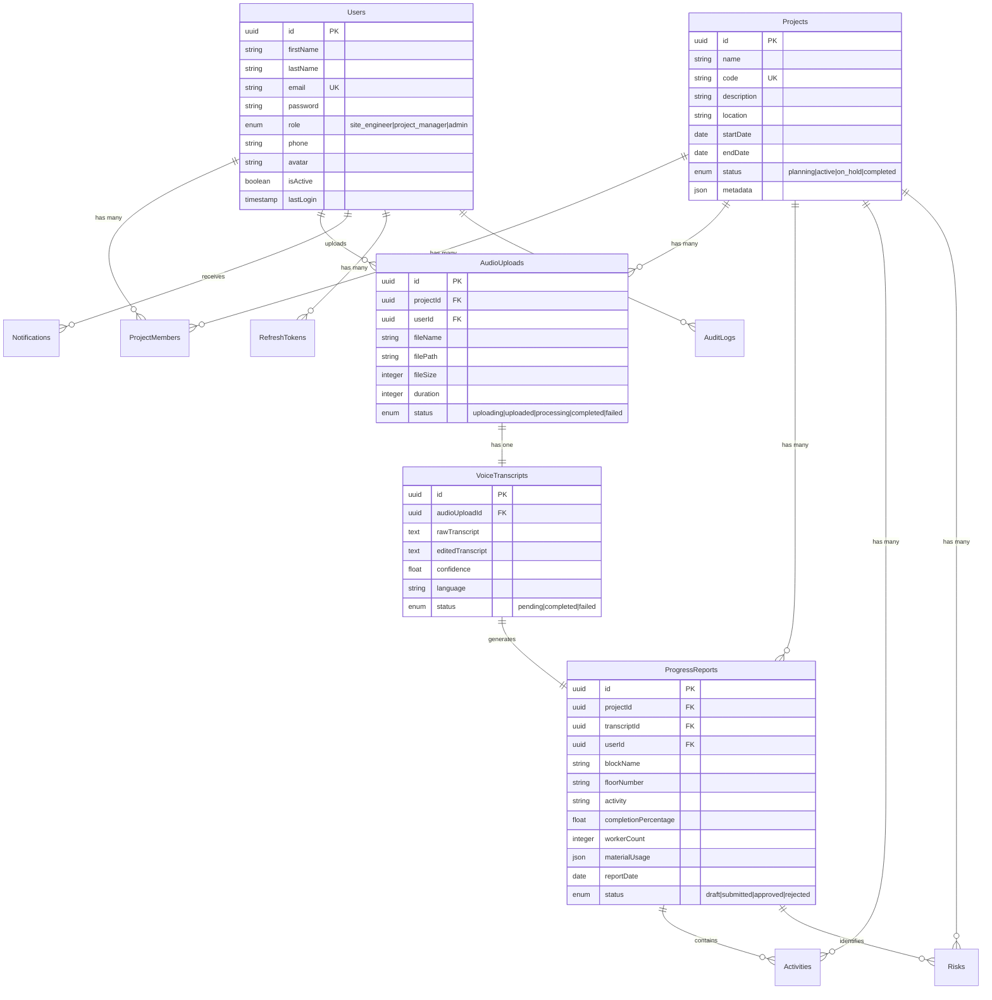
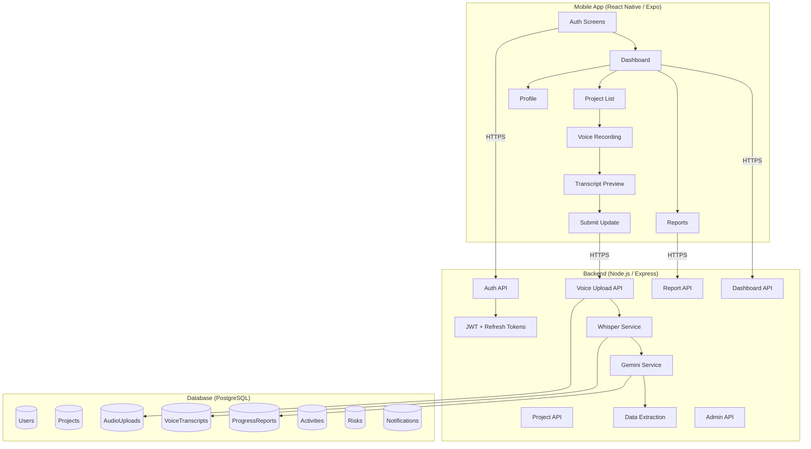

# 🏗️ SiteVoice AI

> **AI-powered voice reporting for construction sites** — Record → Transcribe → Extract → Report

A production-ready cross-platform mobile app for construction site engineers to record voice updates, transcribe audio via **OpenAI Whisper**, extract structured project data via **Google Gemini AI**, and generate automated daily progress reports.

---

## ✨ Features

- 🎙️ **Voice Recording** — Record site updates directly from your phone with pause/resume support
- 🔊 **AI Transcription** — Automatic speech-to-text via OpenAI Whisper (supports English & Hindi)
- 🤖 **Smart Data Extraction** — Gemini AI extracts structured data (block, floor, activity, workers, materials, risks) from transcripts
- 📊 **Automated Reports** — Daily / Weekly / Monthly progress reports generated automatically
- 👥 **Role-Based Access** — Site Engineer, Project Manager, and Admin roles with granular permissions
- 🔐 **Secure Auth** — JWT access + refresh tokens, password reset flow
- 📱 **Cross-Platform** — React Native (Expo) app for iOS & Android
- 🐳 **Docker Ready** — One-command backend + PostgreSQL setup

---

## 🔄 How It Works

```
┌──────────────┐     ┌──────────────┐     ┌──────────────┐     ┌──────────────┐
│   🎙️ Record   │────▶│  📝 Whisper   │────▶│  🤖 Gemini    │────▶│  📊 Report   │
│  Voice Note  │     │ Transcription│     │  Extraction  │     │  Generated   │
└──────────────┘     └──────────────┘     └──────────────┘     └──────────────┘
```

1. **Record** — Site engineer records a voice update from the mobile app
2. **Upload** — Audio file is uploaded to the backend via HTTPS
3. **Transcribe** — OpenAI Whisper converts audio to text
4. **Extract** — Gemini AI parses the transcript into structured data (block, floor, activity, completion %, materials, risks)
5. **Review** — Engineer previews and edits the extracted data
6. **Submit** — Report is submitted for PM approval
7. **Dashboard** — Aggregated progress visible to PMs and Admins

---

## 🛠️ Tech Stack

| Layer | Technology |
|-------|-----------|
| **Mobile** | React Native (Expo SDK 56), Expo Router, Zustand, React Query, React Hook Form + Zod |
| **Backend** | Node.js, Express, TypeScript, Sequelize ORM |
| **Database** | PostgreSQL 16 |
| **AI** | OpenAI Whisper (transcription), Google Gemini 2.0 Flash (data extraction) |
| **Auth** | JWT (access + refresh tokens), bcrypt |
| **DevOps** | Docker Compose, Winston logging |

---

## 📁 Project Structure

```
SiteVoice-AI/
├── mobile/                          # React Native (Expo) App
│   ├── app/                         # Expo Router screens
│   │   ├── (auth)/                  # Login, Register, Forgot Password
│   │   ├── (app)/                   # Authenticated screens
│   │   │   ├── (tabs)/             # Home, Projects, Reports, Profile
│   │   │   ├── project/            # Project details & voice recording
│   │   │   ├── transcript/         # Transcript preview & editing
│   │   │   ├── report/             # Report detail & approval
│   │   │   └── admin/              # User & project management
│   │   └── _layout.tsx
│   ├── src/
│   │   ├── components/             # UI, Audio, Charts, Layout
│   │   ├── features/               # Auth, Projects, Recording, Reports, Admin
│   │   ├── hooks/                  # Custom hooks
│   │   ├── services/               # Axios API client & endpoint definitions
│   │   ├── stores/                 # Zustand auth store
│   │   ├── theme/                  # Color palette, typography, spacing
│   │   ├── types/                  # TypeScript interfaces
│   │   └── utils/                  # Helper utilities
│   └── package.json
│
├── backend/                         # Node.js / Express API
│   ├── src/
│   │   ├── config/                 # DB, env, Swagger config
│   │   ├── controllers/            # Auth, Project, Voice, Transcript, Report, Dashboard, Admin
│   │   ├── middleware/             # Auth, RBAC, Validation, Upload, Error, RateLimit, Logger
│   │   ├── models/                 # 11 Sequelize models (User, Project, Audio, Transcript, etc.)
│   │   ├── routes/                 # RESTful API routes (v1)
│   │   ├── services/               # Business logic + AI integrations (Whisper, Gemini)
│   │   ├── repositories/          # Data access layer
│   │   ├── validators/            # Zod request schemas
│   │   ├── utils/                 # Logger, errors, response helpers
│   │   └── types/                 # TypeScript declarations
│   ├── migrations/                 # Sequelize migrations
│   ├── seeders/                    # Database seeders
│   ├── uploads/                    # Audio file storage (gitignored)
│   └── Dockerfile
│
├── docker-compose.yml              # PostgreSQL + Backend + pgAdmin
├── .env.example                    # Environment template
└── README.md
```

---

## 🚀 Getting Started

### Prerequisites

- **Node.js** ≥ 18
- **Docker & Docker Compose** (for PostgreSQL)
- **Expo CLI** (`npm install -g expo-cli`)
- **API Keys**: [OpenAI](https://platform.openai.com/api-keys) + [Google Gemini](https://aistudio.google.com/apikey)

### 1. Clone & Configure

```bash
git clone https://github.com/your-username/SiteVoice-AI.git
cd SiteVoice-AI

# Copy env template and fill in your values
cp .env.example .env
```

Edit `.env` and set the required values:
```env
# Required API keys
OPENAI_API_KEY=sk-...
GEMINI_API_KEY=AI...

# Database
DB_PASSWORD=your_secure_password

# JWT
JWT_SECRET=your_jwt_secret_here
```

### 2. Start Database (Docker)

```bash
# Start PostgreSQL only
docker-compose up -d postgres

# Or start with pgAdmin for DB management (dev)
docker-compose --profile dev up -d
```

- **PostgreSQL**: `localhost:5432`
- **pgAdmin** (dev profile): `localhost:5050` — Login: `admin@sitevoice.ai` / `admin123`

### 3. Start Backend

```bash
cd backend
npm install

# Run database migrations
npm run db:migrate

# (Optional) Seed sample data
npm run db:seed

# Start dev server
npm run dev
```

Backend runs at `http://localhost:3000`. Swagger docs available at `http://localhost:3000/api-docs`.

### 4. Start Mobile App

```bash
cd mobile
npm install

# Start Expo dev server
npx expo start
```

Scan the QR code with Expo Go (Android/iOS) or press `a` for Android emulator / `i` for iOS simulator.

---

## 🔑 Environment Variables

| Variable | Description | Required |
|----------|------------|----------|
| `NODE_ENV` | `development` / `production` | ✅ |
| `PORT` | Backend port (default: `3000`) | |
| `DB_HOST` | PostgreSQL host | ✅ |
| `DB_PORT` | PostgreSQL port (default: `5432`) | |
| `DB_NAME` | Database name | ✅ |
| `DB_USER` | Database user | ✅ |
| `DB_PASSWORD` | Database password | ✅ |
| `JWT_SECRET` | Secret for signing JWTs | ✅ |
| `JWT_ACCESS_EXPIRY` | Access token expiry (default: `15m`) | |
| `JWT_REFRESH_EXPIRY` | Refresh token expiry (default: `7d`) | |
| `OPENAI_API_KEY` | OpenAI API key (Whisper) | ✅ |
| `GEMINI_API_KEY` | Google Gemini API key | ✅ |
| `GEMINI_MODEL` | Gemini model (default: `gemini-2.0-flash`) | |
| `UPLOAD_DIR` | Audio upload directory (default: `./uploads`) | |
| `MAX_FILE_SIZE` | Max upload size in bytes (default: `26214400` / 25MB) | |
| `SMTP_HOST` | SMTP server for emails | |
| `SMTP_PORT` | SMTP port | |
| `SMTP_USER` | SMTP username | |
| `SMTP_PASS` | SMTP password | |
| `FROM_EMAIL` | Sender email address | |
| `FRONTEND_URL` | Mobile app URL | |

---

## 📡 API Endpoints

### Authentication
| Method | Endpoint | Description | Auth |
|--------|----------|-------------|------|
| POST | `/api/v1/auth/register` | Register new user | No |
| POST | `/api/v1/auth/login` | Login | No |
| POST | `/api/v1/auth/logout` | Logout (revoke refresh token) | Yes |
| POST | `/api/v1/auth/refresh-token` | Refresh access token | No |
| POST | `/api/v1/auth/forgot-password` | Send reset email | No |
| POST | `/api/v1/auth/reset-password` | Reset password with token | No |
| GET | `/api/v1/auth/me` | Get current user profile | Yes |
| PUT | `/api/v1/auth/change-password` | Change password | Yes |

### Projects
| Method | Endpoint | Description | Roles |
|--------|----------|-------------|-------|
| GET | `/api/v1/projects` | List projects (by membership) | All |
| GET | `/api/v1/projects/:id` | Get project details | Members |
| POST | `/api/v1/projects` | Create project | PM, Admin |
| PUT | `/api/v1/projects/:id` | Update project | PM, Admin |
| DELETE | `/api/v1/projects/:id` | Delete project | Admin |
| POST | `/api/v1/projects/:id/members` | Add member | PM, Admin |
| DELETE | `/api/v1/projects/:id/members/:userId` | Remove member | PM, Admin |

### Voice Upload & AI Pipeline
| Method | Endpoint | Description | Roles |
|--------|----------|-------------|-------|
| POST | `/api/v1/voice/upload` | Upload audio file | Engineer |
| GET | `/api/v1/voice/uploads` | List user's uploads | All |
| GET | `/api/v1/voice/uploads/:id` | Get upload details | Owner |
| POST | `/api/v1/voice/uploads/:id/process` | Trigger AI processing | Engineer |
| DELETE | `/api/v1/voice/uploads/:id` | Delete upload | Owner |

### Transcripts
| Method | Endpoint | Description | Roles |
|--------|----------|-------------|-------|
| GET | `/api/v1/transcripts/:id` | Get transcript | Owner, PM |
| PUT | `/api/v1/transcripts/:id` | Edit transcript | Owner |
| POST | `/api/v1/transcripts/:id/reprocess` | Re-extract data | Owner |

### Reports
| Method | Endpoint | Description | Roles |
|--------|----------|-------------|-------|
| GET | `/api/v1/reports` | List reports (with filters) | All |
| GET | `/api/v1/reports/:id` | Get report details | Members |
| PUT | `/api/v1/reports/:id` | Update/approve report | PM |
| POST | `/api/v1/reports/:id/submit` | Submit draft report | Engineer |
| GET | `/api/v1/reports/daily` | Daily aggregated report | PM, Admin |
| GET | `/api/v1/reports/weekly` | Weekly aggregated report | PM, Admin |
| GET | `/api/v1/reports/monthly` | Monthly aggregated report | PM, Admin |

### Dashboard
| Method | Endpoint | Description | Roles |
|--------|----------|-------------|-------|
| GET | `/api/v1/dashboard/overview` | Dashboard stats | All |
| GET | `/api/v1/dashboard/projects/:id/progress` | Project progress | Members |
| GET | `/api/v1/dashboard/risks` | Risks overview | PM, Admin |
| GET | `/api/v1/dashboard/activities` | Pending activities | PM, Admin |
| GET | `/api/v1/dashboard/timeline` | Activity timeline | All |

### Admin
| Method | Endpoint | Description | Roles |
|--------|----------|-------------|-------|
| GET | `/api/v1/admin/users` | List all users | Admin |
| PUT | `/api/v1/admin/users/:id` | Update user | Admin |
| DELETE | `/api/v1/admin/users/:id` | Deactivate user | Admin |
| PUT | `/api/v1/admin/users/:id/role` | Change user role | Admin |
| GET | `/api/v1/admin/audit-logs` | View audit logs | Admin |

---

## 🤖 AI Pipeline

### Step 1: Whisper Transcription
```
Audio File (.m4a) → OpenAI Whisper API → Raw Transcript Text
```
- **Model**: `whisper-1` (or `gpt-4o-transcribe` for higher quality)
- **Max file size**: 25MB (chunked if larger)
- **Language**: Auto-detect (primarily English/Hindi)

### Step 2: Gemini Structured Extraction

The transcript is sent to Gemini with a construction-domain system prompt. It extracts:

```json
{
  "block_name": "Block A",
  "floor_number": "3rd Floor",
  "activity": "Column shuttering",
  "completion_percentage": 75,
  "worker_count": 12,
  "start_time": "08:00",
  "end_time": "17:00",
  "material_usage": [
    { "material": "Steel", "quantity": "2.5", "unit": "tonnes" }
  ],
  "weather_condition": "Cloudy",
  "issues": [
    { "description": "Rebar delivery delayed", "severity": "medium", "category": "schedule" }
  ],
  "safety_incidents": [],
  "notes": "Concrete pour scheduled for tomorrow",
  "report_date": "2026-06-12"
}
```

---

## 🗄️ Database Schema

### Entity Relationship Diagram



**All 11 Models**: User, Project, ProjectMember, AudioUpload, VoiceTranscript, ProgressReport, Activity, Risk, Notification, RefreshToken, AuditLog

---

## 🏗️ Architecture Overview



---

## 🐳 Docker

```bash
# Full stack (PostgreSQL + Backend)
docker-compose up -d

# With pgAdmin (dev only)
docker-compose --profile dev up -d

# Stop all services
docker-compose down

# Stop and remove data volumes
docker-compose down -v
```

---

## 📜 Available Scripts

### Backend (`/backend`)

| Script | Command | Description |
|--------|---------|-------------|
| Dev Server | `npm run dev` | Start with hot-reload (ts-node-dev) |
| Build | `npm run build` | Compile TypeScript to `dist/` |
| Start | `npm start` | Run compiled JS (production) |
| Lint | `npm run lint` | ESLint check |
| Type Check | `npm run typecheck` | TypeScript type verification |
| Migrate | `npm run db:migrate` | Run pending migrations |
| Undo Migration | `npm run db:migrate:undo` | Revert last migration |
| Seed | `npm run db:seed` | Populate sample data |
| Undo Seeds | `npm run db:seed:undo` | Remove seeded data |

### Mobile (`/mobile`)

| Script | Command | Description |
|--------|---------|-------------|
| Start | `npm start` | Expo dev server |
| Android | `npm run android` | Run on Android device/emulator |
| iOS | `npm run ios` | Run on iOS simulator |
| Web | `npm run web` | Run in web browser |

---

## 👥 Roles & Permissions

| Feature | Site Engineer | Project Manager | Admin |
|---------|:------------:|:---------------:|:-----:|
| Record voice updates | ✅ | — | — |
| View own transcripts | ✅ | ✅ | ✅ |
| Edit transcripts | ✅ | — | — |
| Submit reports | ✅ | — | — |
| Approve/reject reports | — | ✅ | ✅ |
| View project dashboard | ✅ | ✅ | ✅ |
| Create projects | — | ✅ | ✅ |
| Manage project members | — | ✅ | ✅ |
| User management | — | — | ✅ |
| View audit logs | — | — | ✅ |

---

## 📋 Implementation Plan (Phased Execution)

> The following documents the full development roadmap. Completed phases are marked; remaining phases are in progress or planned.

### Phase 1: Project Scaffolding & Configuration ✅

#### [NEW] Root Configuration Files
- `docker-compose.yml` — PostgreSQL + Backend services
- `.env.example` — All environment variables template
- `.gitignore` — Comprehensive ignore rules
- `README.md` — Project documentation

#### [NEW] Backend Initialization
- Initialize Node.js/Express project with TypeScript
- Configure `tsconfig.json`, ESLint, Prettier
- Setup Sequelize with PostgreSQL connection
- Create `.sequelizerc` for migration paths

#### [NEW] Mobile Initialization
- Initialize Expo project with TypeScript template
- Configure `app.json` with permissions (microphone, etc.)
- Setup path aliases in `tsconfig.json`
- Install core dependencies (React Navigation, React Query, Zustand, Axios, etc.)

---

### Phase 2: Database Layer ✅

#### [NEW] Sequelize Models
All 11 models with full TypeScript types:
- `User.ts`, `Project.ts`, `ProjectMember.ts`, `AudioUpload.ts`
- `VoiceTranscript.ts`, `ProgressReport.ts`, `Risk.ts`, `Activity.ts`
- `Notification.ts`, `RefreshToken.ts`, `AuditLog.ts`
- `index.ts` — Model associations and initialization

#### [NEW] Migrations
One migration per table with proper foreign keys, indexes, and constraints.

#### [NEW] Seeders
- Default admin user seeder
- Sample project data seeder

---

### Phase 3: Backend Core — Auth & Middleware ✅

#### [NEW] Middleware Stack
- `auth.middleware.ts` — JWT verification
- `role.middleware.ts` — RBAC authorization
- `validation.middleware.ts` — Zod schema validation
- `upload.middleware.ts` — Multer file upload config
- `error.middleware.ts` — Global error handler
- `rateLimiter.middleware.ts` — Rate limiting
- `logger.middleware.ts` — Request logging

#### [NEW] Auth System
- `auth.controller.ts` + `auth.service.ts` + `auth.routes.ts`
- `auth.validator.ts` — Zod schemas for login/register/etc.
- JWT access tokens (15min) + refresh tokens (7 days)
- Password hashing with bcrypt
- Forgot password with token-based reset

---

### Phase 4: Backend Core — Business Logic ✅

#### [NEW] Project Management
- `project.controller.ts` + `project.service.ts` + `project.routes.ts`
- Member management, CRUD with role-based access

#### [NEW] Voice Upload & AI Pipeline
- `voice.controller.ts` + `voice.service.ts` + `voice.routes.ts`
- `whisper.service.ts` — OpenAI Whisper integration
- `gemini.service.ts` — Gemini structured extraction
- `transcript.controller.ts` + `transcript.service.ts`
- Multer upload → Whisper transcription → Gemini extraction → DB storage

#### [NEW] Reports & Dashboard
- `report.controller.ts` + `report.service.ts` + `report.routes.ts`
- `dashboard.controller.ts` + `dashboard.service.ts`
- Daily/Weekly/Monthly aggregation queries
- AI-generated summary via Gemini

#### [NEW] Admin & Utilities
- `admin.controller.ts` + `admin.routes.ts`
- `notification.service.ts`
- `auditLog.service.ts`
- Swagger/OpenAPI documentation setup

---

### Phase 5: Mobile App — Foundation ✅

#### [NEW] Theme & Design System
- Color palette, typography, spacing
- Reusable UI components: Button, Input, Card, Badge, Modal, Toast, etc.
- Dark mode support

#### [NEW] Navigation & Auth Flow
- Expo Router layout files
- Auth screens: Login, Register, Forgot Password
- Secure token storage with `expo-secure-store`
- Auth state management with Zustand

#### [NEW] API Service Layer
- Axios instance with interceptors (auth token, refresh, error handling)
- Endpoint definitions for all API routes
- React Query configuration

---

### Phase 6: Mobile App — Core Features ✅

#### [NEW] Dashboard & Projects
- Home dashboard with stats cards, charts, recent activity
- Project list with search and filters
- Project detail screen with progress visualization

#### [NEW] Voice Recording
- Recording screen with `expo-audio`
- Pause/Resume/Stop controls
- Upload with progress indicator
- Retry on failure
- Offline recording support (queue for later upload)

#### [NEW] Transcript & Reports
- Transcript preview with edit capability
- Structured data display
- Report submission flow
- Daily/Weekly/Monthly report views with filters

---

### Phase 7: Mobile App — Advanced Features 🔲

#### [NEW] Profile & Settings
- Edit profile, change password
- Notification settings

#### [NEW] Admin Screens
- User management list
- Project management (create/edit)
- Role management

#### [NEW] Additional Features
- Push notifications setup
- Activity timeline view
- Search and filter components
- Form validation with React Hook Form + Zod

---

### Phase 8: Docker, Documentation & Polish 🔲

#### [NEW] Docker Configuration
- `backend/Dockerfile` — Multi-stage build
- `docker-compose.yml` — PostgreSQL + Backend + optional pgAdmin
- Environment-based configuration

#### [NEW] Documentation
- Complete API documentation via Swagger
- Deployment guide
- Development setup guide

---

## 📄 License

This project is private and unlicensed.
